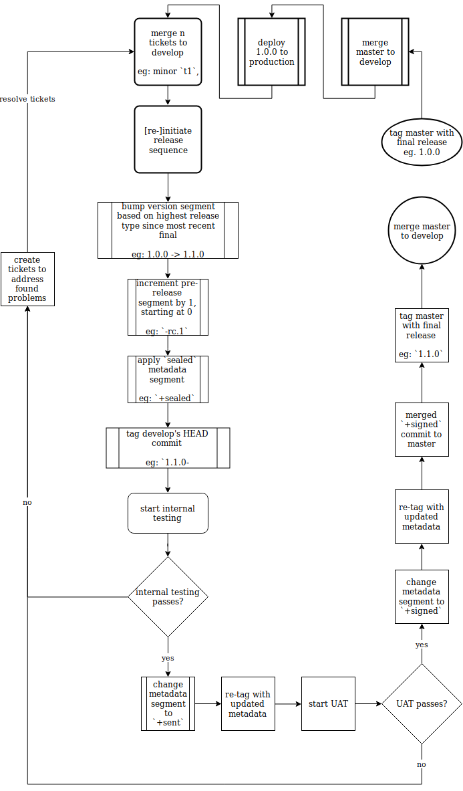

This repo provides an [Errbot][1] plugin which integrates with both Jira and GitHub to produce version releases on both
platforms.  It looks at all merged GitHub pull requests (PRs hereafter) and closed Jira tickets since the last version
to determine the version number and to produce changelogs.

# Features
- coordinated version creation between Jira and Github
- [SemVer][4] and [PEP440][2] version numbers
- detailed changelog creation
- hotfix-release support
- pre-release support
- an opinionated workflow

This plugin **does not** manage actually deploying code to your server.  Any documentation here which mentions deployment
presumes you have additional tooling set up for that.

# Workflow
1. developers mark Jira issues as `resolved` and set a `release type` (SemVer)
2. maintainers merge GitHub PRs and mark their corresponding Jira issues as `closed`
3. when all desired PRs are merged and their tickets are closed, calling this plugin initiates the release sequence,
   which consists of three steps:
    - `sealed`: internal QA has sealed an iteration of `develop` for testing, ready for internal QA
    - `sent`: internal QA has signed off on a `sealed` `develop`, ready for user acceptance testing (UAT hereafter)
    - `signed`: UAT has validated a `sent` release, ready for shipping

## Hotfix vs. Standard Releases
Hotfix releases and standard releases follow the same versioning scheme, with a few workflow exceptions:
- hotfixes MUST be created in a branch called `hotfix`
- hotfixes MUST be based on `master`
- hotfix branches MUST be deleted after a final hotfix version is built
- hotfix branches MUST NOT be merged to any other branch, including, but not limited to, `master` and `develop`
- hotfix tickets MUST be merged to the `hotfix` branch or discarded (if ticket is aborted)
- hotfix tickets MUST have a corresponding ticket to be backported to `develop`
- hotfix releases MUST include the word `hotfix` in their metadata segment at all stages of the release cycle
- ?? hotfixes MUST NOT contain ANY database migrations

# GitHub and Jira Interactions
- version creation in Jira
- release creation in GitHub
- changelog creation from Jira issues
- git tag creation using SemVer and PEP440

# Jira Requirements
- authentication credentials
- issue fields:
  - `Release Type` (custom): `major`, `minor`, `patch`, `TBD`
  - `Type`
  - `Affects Version/s`
  - `Fix Version/s`

# Versioning
## Format Example
- `1.1.0-rc.1+sealed`: entire version string
- `1.1.0`: SemVer release version segment
- `-rc.1`: pre-release segment
- `+sealed`: metadata segment

## Workflow Example

- start with `baseVersion=1.0.0`:
  - this is the last shipped version
  - `master` and `develop` are both here
    - `develop` holds the additonal merge commit produced by the previous release
- merge two tickets (minor and patch) to `develop`
- initiate release sequence:
  - `1.1.0-rc.1+sealed` tag applied to `develop`'s HEAD
- do internal testing:
  - pass:
    - retag the commit with tag `1.1.0-rc.1+sealed` as `1.1.0-rc.1+sent`
  - fail
    - create two new tickets (major, patch) and merge their PRs to `develop`
    - re-initiate release sequence, creating a new version tag on `develop` to `2.0.0-rc.2+sealed`:
      - increment pre-release segment `rc.N` by one:
        - `rc.1` -> `rc.2`
      - reset metadata segment:
        - `sent` -> `sealed`
      - bump version numbers according to SemVer
        - `1.1.0` -> `2.0.0` because a major ticket is now included
        - *note:* the version bump is applied to the `baseVersion` (`1.0.0`), not failed version (`1.1.0-rc.1+sealed`)
    - return to internal testing
- do UAT:
  - pass (presume first internal testing passed, so use `1.1.0-rc.1+sent`):
    - retag the commit with tag `1.1.0-rc.1+sent` as `1.1.0-rc.1+signed`
    - when build pipeline sees a `signed` tag, it produces a final release:
      - `1.1.0` final is built and deployed
      - add changelog to `master` and merge `master` to `develop`
      - `master` and `develop` are now identical except for the merge commit in `develop` showing `master` getting
        merged to it
  - fail:
    - follow a similar process as when fail happened in internal testing

### Condensed Example
- start with `develop` and `master` on `1.0.0`
- merge two tickets (minor `t1`, patch `t2`) to `develop`
- initiate release sequence by tagging `develop`'s HEAD (commit `c1`) with `1.1.0-rc.1+sealed`
- start internal testing:
  - if passes, re-tag commit `c1` with `1.1.0-rc.1+sent`
  - if fails:
    - merge two fix tickets (major `t3`, patch `t4`) to `develop` addressing found problems (not necessarily related to
      `t1` and `t2`)
    - re-initiate release sequence by tagging `develop`'s *new* HEAD (commit `c2`) with `2.0.0-rc.2+sealed`
    - return to internal testing
- start UAT:
  - if passes, re-tag commit `c1` with `1.1.0-rc.1+signed`; it's ready to create a final by stripping it down to `1.1.0`
  - if fails, create/merge new tickets and return to internal testing
- merge the `+signed` commit (regardless of version) to `master` and merge `master` to `develop`
- deploy the final `1.1.0` (or later, if there were failures and multiple testing rounds) version

[1]: http://errbot.io/en/latest/
[2]: https://www.python.org/dev/peps/pep-0440/
[4]: https://semver.org/
[5]: https://help.github.com/articles/creating-releases/

<!--- vi: set ft=markdown : -->
